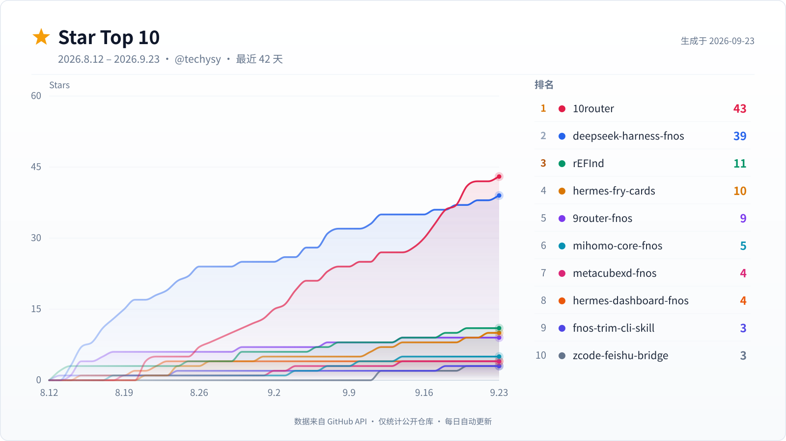
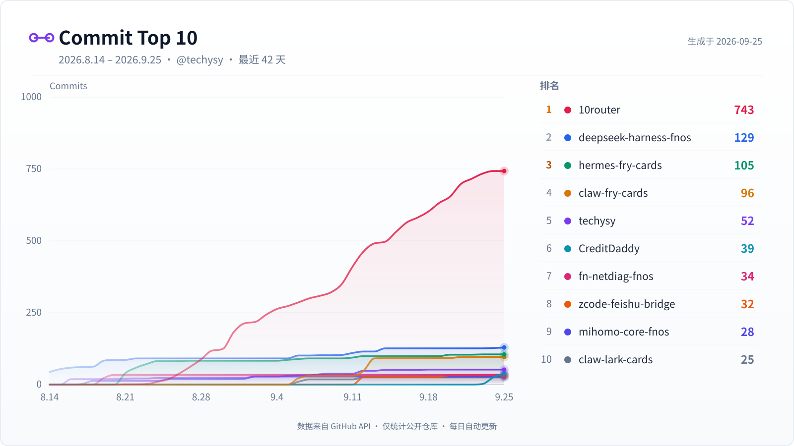

# 👋 Hi, I'm ShiYanG Yu (洋芋) — @techysy

> 🎞️ I use film, record my life and my friends 😼
> 📍 Chengdu, China · 🏔️ Cycling & Hiking · 💻 fnOS / NAS / AI Agent

---

## 🚀 核心项目 / Featured Projects

### 🐋 DeepSeek Harness (dsh)

> [**DeepSeek Harness (dsh)**](https://github.com/techysy/deepseek-harness-fnos) — DeepSeek Harness 官方 Agent 浏览器 UI 的 fnOS 应用
>
> 本地常驻服务 · DeepSeek 官方 Agent 浏览器界面 · 插件化设计 · 局域网 + FN Connect 远程访问
>
> 
> 
> 
> 

### 🚦 10Router

> [**10Router**](https://github.com/techysy/10router) — 本地 AI 路由网关 & Dashboard（9Router 精简优化版）
>
> 40+ 上游供应商路由 · 格式翻译 · 模型 Combo / 多账号 fallback · OAuth / API-key 凭据管理 · Token 刷新 · 配额用量追踪 · 可选云端同步
>
> 
> 
> 
> 

### 🖥️ fnOS 应用（飞牛 NAS）

| 项目 | 版本 | 说明 |
|------|------|------|
| [**Hermes Agent**](https://github.com/techysy/hermes-dashboard-fnos) |  | Hermes 控制台快捷入口 · 可配置目标仪表盘 |
| [**Hugo Blog**](https://github.com/techysy/hugo-blog-fnos) |  | Hugo 静态博客 · 常驻渲染 · 管理面板 |
| [**Mihomo Core**](https://github.com/techysy/mihomo-core-fnos) |  | Mihomo 内核 fnOS 应用 |
| [**MetaCubeXD**](https://github.com/techysy/metacubexd-fnos) |  | Mihomo Dashboard |
| [**Strava Panel**](https://github.com/techysy/strava-panel-fnos) |  | 骑行数据面板 · 凭据 + Token 刷新 + 统计 |

### 🤖 Hermes Agent 技能 & 工具

| 项目 | 版本 | 说明 |
|------|------|------|
| [**yangyu-hermes-skills**](https://github.com/techysy/yangyu-hermes-skills) |  | 🐟 Hermes Agent 技能集合（13 个技能：Git 生命周期、飞书、TTS/STT、代理、成本管理等） |
| [**hermes-fry-cards**](https://github.com/techysy/hermes-fry-cards) |  | 🍟 Hermes 飞书流式卡片插件（CardKit v2.0，正在使用中） |
| [**hermes-core-fnos**](https://github.com/techysy/hermes-core-fnos) |  | Hermes Agent 本地内核 fnOS 应用 |
| [**hermes-webui-fnos**](https://github.com/techysy/hermes-webui-fnos) |  | Hermes WebUI fnOS 封装 |

### 🛠️ 开源工具 & 其他

- [**spot-studio**](https://github.com/techysy/spot-studio) — 🚴🥾 骑行 & 徒步活动发布平台（GPX 渲染 / 海拔 / POI）
- [**inspection-visualizer**](https://github.com/techysy/inspection-visualizer) — OCR 巡检记录管理
- [**navi-bookmarks-chrome**](https://github.com/techysy/navi-bookmarks-chrome) — 运维书签导航
- [**web-jpg-tool**](https://github.com/techysy/web-jpg-tool) — 图片合并工具
- [**techysy.github.io**](https://github.com/techysy/techysy.github.io) — Jekyll 静态博客

---

## 📊 GitHub 统计

### ⭐ Star Top 10

### 📝 Commit Top 10

---

## 🌐 我的博客 / Blog

- 🌐 [shiyangyu.com](https://shiyangyu.com)
- 📝 [techysy.github.io](https://techysy.github.io)
